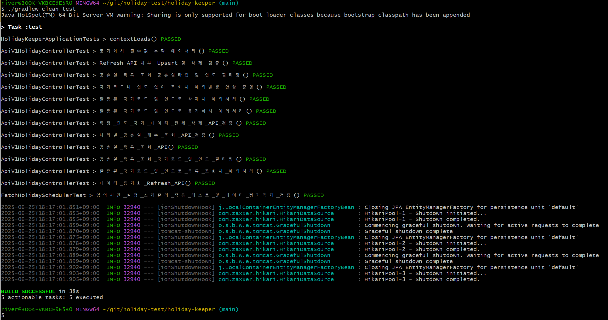

# Holiday Keeper

Nager.Date 무인증 API를 활용한 전 세계 공휴일 데이터 관리 서비스

최근 5년(2020-2025)의 전 세계 공휴일 데이터를 저장·조회·관리하는 Mini Service
- 참고
    - UI/UX : [https://www.holiday.backnback.site](https://www.holiday.backnback.site/)
    - Backend 배포 : [https://api.backnback.site](https://api.backnback.site/)

<br>

## ✔️ 목차
- [✔️ 프로젝트 개요](#️-프로젝트-개요)
- [✔️ 주요 기술 스택](#️-주요-기술-스택)
- [✔️ 빌드 \& 실행 방법](#️-빌드--실행-방법)
- [✔️ 공통 응답](#️-공통-응답)
- [✔️ API 명세](#️-api-명세)
- [✔️ 데이터베이스 설계](#️-데이터베이스-설계)
- [✔️ 주요 기능](#️-주요-기능)
- [✔️ 테스트](#️-테스트)
- [✔️ 성능 최적화](#️-성능-최적화)
- [✔️ 트러블슈팅](#️-트러블슈팅)
- [✔️ 향후 개선 고려 사항](#️-향후-개선-고려-사항)


<br>
<br>

## ✔️ 프로젝트 개요


| **항목**         | **내용**                           |
| ---------------- | ---------------------------------- |
| **프로젝트명**   | Holiday Keeper API                 |
| **설명**         | 공휴일 관리 시스템 API             |
| **API 버전**     | v1.0.0                             |
| **OpenAPI 버전** | 3.0.1                              |
| **Base URL**     | `https://api.backnback.com/api/v1` |
| **문서 버전**    | 1.0.0                              |
| **최종 수정일**  | 2025-06-25                         |

<br>

### 목표

* 외부 API 두 개만으로 최근 5년(2020 ~ 2025)의 전 세계 공휴일 데이터를 저장·조회·관리하는 Mini Service 구현

<br>

### 사용 외부 API

- **가능한 국가 목록** : `GET https://date.nager.at/api/v3/AvailableCountries`
- **공휴일 데이터** : `GET https://date.nager.at/api/v3/PublicHolidays/{year}/{countryCode}`

<br>
<br>

## ✔️ 주요 기술 스택


| **Backend**  |                   |
| ------------ | ----------------- |
| 언어         | Java 21           |
| 프레임워크   | Spring Boot 3.4.2 |
| 데이터베이스 | 인메모리 H2       |
| ORM          | JPA(Hibernate)    |
| 테스트       | JUnit 5           |
| 문서화       | Swagger UI        |
| CI           | Github Actions CI |

- UI/UX : React, Tailwind CSS, Vite, Vercel(배포)
- Backend 배포 : Docker, Terraform, AWS(프리티어)


<br>
<br>

## ✔️ 빌드 & 실행 방법

### 실행 단계

1. Github 레포지토리 클론
    
    ```bash
    git clone https://github.com/backnback/holiday-keeper
    cd holiday-keeper
    ```
    

1. 애플리케이션 실행
    
    ```bash
    ./gradlew bootRun
    ```
    

- 테스트 실행
    
    ```bash
    ./gradlew clean test
    ```
    

<br>


### 접근 URL

- **애플리케이션(로컬)** : http://localhost:8090  ⇒  swagger-ui로 이동
- **Swagger UI** : http://localhost:8090/swagger-ui/index.html
- **H2 Console** : http://localhost:8090/h2-console
    - JDBC URL : `jdbc:h2:mem:hk_db`
    - Username : `sa`
    - Password : (공백)

<br>

- UI/UX : [https://www.holiday.backnback.site](https://www.holiday.backnback.site/)
- Backend 배포 : [https://api.backnback.site](https://api.backnback.site/)

<br>

### 최초 실행 시 데이터 적재 발생

애플리케이션 시작과 함께 최근 5년간의 전 세계 공휴일 데이터가 자동으로 적재됩니다. (약 5초 소요)

<br>
<br>

## ✔️ 공통 응답

### 성공 응답 예시

```json
{
  "resultCode": "200",
  "msg": "나라별 공휴일 개수 조회 성공",
  "data": {
	  ...
  }
}
```

<br>

### 에러 응답 예시

```json
{
  "timestamp": "2025-06-25T00:55:02.8142141",
  "status": 400,
  "error": "BAD_REQUEST",
  "message": "입력값이 올바르지 않습니다."
}
```

<br>

### 커스텀 페이지네이션 응답 예시

```json
{
  "page": 0,
  "size": 0,
  "totalElements": 0,
  "totalPages": 0,
  "empty": true,
  "numberOfElements": 0,
  "content": [
    {
      "id": 233,
      "date": "2025-10-13",
      "localName": "Columbus Day",
      "name": "Columbus Day",
      "countryCode": "US",
      "global": false,
      "counties": [
        "string"
      ],
      "launchYear": 0,
      "types": [
        "PUBLIC"
      ]
    }
  ],
  "first": true,
  "last": true,
  "offset": 0
}
```

<br>
<br>

## ✔️ API 명세

### 1. 공휴일 목록 조회 (페이징, 필터링, 정렬)

```
GET /api/v1/holidays
```

- **Query Parameters**
    
    
    | 파라미터    | 타입      | 필수 | 기본값 | 설명                          |
    | ----------- | --------- | ---- | ------ | ----------------------------- |
    | page        | int       | N    | 0      | 페이지 번호 (0부터 시작)      |
    | size        | int       | N    | 10     | 페이지 사이즈                 |
    | year        | Integer   | N    | -      | 연도 필터 (2021-2025)         |
    | countryCode | String    | N    | -      | 국가 코드 (예: KR, US)        |
    | from        | LocalDate | N    | -      | 시작 날짜 (YYYY-MM-DD)        |
    | to          | LocalDate | N    | -      | 종료 날짜 (YYYY-MM-DD)        |
    | type        | String    | N    | -      | 공휴일 타입 (PUBLIC, BANK 등) |
    | name        | String    | N    | -      | 공휴일 이름 검색              |
    | sort        | String    | N    | asc    | 정렬 기준 (date)              |
    

<br>

- **Response 200 OK**
    
    ```json
    {
      "resultCode": "200",
      "msg": "공휴일 목록 조회 성공",
      "data": {
        "page": 0,
        "size": 10,
        "totalElements": 15,
        "totalPages": 2,
        "empty": true,
        "numberOfElements": 0,
        "content": [
          {
            "id": 233,
            "date": "2025-10-13",
            "localName": "Columbus Day",
            "name": "Columbus Day",
            "countryCode": "US",
            "global": false,
            "counties": [
              "string"
            ],
            "launchYear": 0,
            "types": [
              "PUBLIC"
            ]
          }
        ],
        "first": true,
        "last": false,
        "offset": 0
      }
    }
    ```
    

<br>

<br>

### 2. 특정 연도 및 국가 데이터 동기화 (Refresh)

```
POST /api/v1/holidays/sync
```

- **Request Body**
    
    ```json
    {
      "year": 2025,
      "countryCode": "KR"
    }
    ```
    
    - **Validation Rules**
        - `year` : 필수
        - `countryCode` : 필수

<br>

- **Response 204 No Content**
    
    ```json
    {
      "resultCode": "204",
      "msg": "동기화 완료"
    }
    ```
    

<br>

<br>

### 3. 특정 연도 및 국각 데이터 전체 삭제

```
DELETE /api/v1/holidays/{countryCode}/{year}
```

- **Path Parameters**
    
    
    | 파라미터    | 타입    | 필수 | 기본값 | 설명                   |
    | ----------- | ------- | ---- | ------ | ---------------------- |
    | year        | Integer | Y    | -      | 연도 필터 (2021-2025)  |
    | countryCode | String  | Y    | -      | 국가 코드 (예: KR, US) |
    - path parameters null 불가
    

<br>

- **Response 204 No Content**
    
    ```json
    {
      "resultCode": "204",
      "msg": "15개 데이터 삭제 완료"
    }
    ```
    

<br>

<br>

### 4. 국가별 공휴일 개수 조회  (페이징)

```
GET /api/v1/holidays/countries
```

- **Query Parameters**
    
    
    | 파라미터 | 타입    | 필수 | 기본값 | 설명                     |
    | -------- | ------- | ---- | ------ | ------------------------ |
    | page     | int     | N    | 0      | 페이지 번호 (0부터 시작) |
    | size     | int     | N    | 30     | 페이지 사이즈            |
    | year     | Integer | N    | 2025   | 연도 필터 (2021-2025)    |
    | sort     | String  | N    | desc   | 정렬 기준 (holidayCount) |
    - `holidayCount` : 특정 연도, 특정 국가의 공휴일 수
    

<br>

- **Response 200 OK**
    
    ```json
    {
      "resultCode": "200",
      "msg": "나라별 공휴일 개수 조회 성공",
      "data": {
        "page": 0,
        "size": 30,
        "totalElements": 117,
        "totalPages": 4,
        "empty": false,
        "numberOfElements": 30,
        "content": [
          {
            "countryCode": "VE",
            "name": "Venezuela",
            "holidayCount": 34
          },
          {
            "countryCode": "ES",
            "name": "Spain",
            "holidayCount": 32
          },
    
    			...
    
          {
            "countryCode": "JP",
            "name": "Japan",
            "holidayCount": 16
          }
        ],
        "first": true,
        "last": false,
        "offset": 0
      }
    }
    ```
    

<br>

<br>

## ✔️ 데이터베이스 설계

### ERD

```
Countries (국가)
├── id (PK)
├── country_code (UK)
├── name
├── created_at
└── modified_at

Holidays (공휴일)
├── id (PK)
├── country_id (FK)
├── date
├── name
├── local_name
├── holiday_year
├── launch_year
├── global
├── counties (CSV)
├── types (CSV)
├── created_at
├── modified_at
└── UK(country_id, date, name)

```

<br>

### 인덱스 전략  (성능 최적화)

```sql
indexes = {
	@Index(name = "idx_year", columnList = "holidayYear"),
	@Index(name = "idx_country_year", columnList = "country_id, holidayYear")
}
```

- 자주 사용되는 쿼리

<br>
<br>

## ✔️ 주요 기능

### 1. 데이터 적재

- **최초 실행 시** : 최근 5년(2021-2025) × 전체 국가 데이터 일괄 적재
- **병렬 처리** : ForkJoinPool(30)을 활용한 API 호출
- **소요 시간** : 약 5초 내외  (117 국가 × 5년)

<br>

### 2. 데이터 재동기화 (Upsert 패턴)

```sql
INSERT INTO holidays (...) VALUES (...)
ON DUPLICATE KEY UPDATE
    local_name = VALUES(local_name),
    modified_at = :syncTime
```

- 신규 데이터는 INSERT, 기존 데이터는 UPDATE
    - `MySQL ON DUPLICATE KEY UPDATE` 활용
- 동기화 시점 기반으로 외부 API에서 누락된 데이터 DB에서 자동 삭제
- 데이터 일관성 보장

<br>

### 3. 다양한 검색 옵션

- **기본 필터** : 연도, 국가, 날짜 범위
- **고급 필터** : 공휴일 타입, 이름(영문명) 검색
- **정렬 및 페이징** : 날짜순 정렬

<br>


### 4. 자동 배치 스케줄링

- 매년 1월 2일 01:00 KST에 전년도·금년도 데이터 자동 동기화
    
    ```java
    @Scheduled(cron = "0 0 1 2 1 ?", zone = "Asia/Seoul")
    ```
    
- `application.yml`
    
    ```yaml
    schedule.useInit: true      # 초기 데이터 로딩 여부
    schedule.useSchedule: true  # 스케줄러 활성화 여부
    ```
    

<br>

### 5. 예외 처리 전략

- **전역 예외 핸들러** : `@RestControllerAdvice`
- **커스텀 예외** : `CustomException + ErrorCode`
    
    ```java
    @Getter
    @AllArgsConstructor
    public enum ErrorCode {
    
      // 공통 에러
      INVALID_INPUT_VALUE(HttpStatus.BAD_REQUEST, "입력값이 올바르지 않습니다."),
      INVALID_TYPE_VALUE(HttpStatus.BAD_REQUEST, "타입이 올바르지 않습니다."),
      ENTITY_NOT_FOUND(HttpStatus.NOT_FOUND, "엔티티를 찾을 수 없습니다."),
      INTERNAL_SERVER_ERROR(HttpStatus.INTERNAL_SERVER_ERROR, "서버 오류가 발생했습니다."),
    
      // Country 관련
      INVALID_COUNTRY_CODE(HttpStatus.BAD_REQUEST, "유효하지 않은 국가 코드입니다"),
      COUNTRY_CODE_REQUIRED(HttpStatus.BAD_REQUEST, "국가 코드는 필수 입력값입니다."),
    
      // Holiday 관련
      INVALID_YEAR_RANGE(HttpStatus.BAD_REQUEST, "연도는 최근 5년 범위 내에서만 가능합니다."),
      YEAR_REQUIRED(HttpStatus.BAD_REQUEST, "연도는 필수 입력값입니다.");
      
    
      private final HttpStatus httpStatus;
      private final String message;
    }
    ```
    
- **일관된 응답** : `ErrorResponse` 래퍼 클래스


<br>

<br>

## ✔️ 테스트

### 테스트 실행

```bash
# 전체 테스트 실행
./gradlew clean test

# 테스트 리포트 확인
위치 : build/test-results/test/
```

<br>

### 테스트 범위

- **통합 테스트**
    - 전체 API 엔드포인트 시나리오 검증
    - Upsert 로직 및 데이터 일관성 검증
    - 예외 처리 테스트
- **스케줄러 테스트**
    - 자동 배치 동작 확인

<br>

### 주요 테스트 시나리오

1. **공휴일 목록 조회** - 기본 조회, 필터링, 페이징
2. **데이터 동기화** - Refresh API 및 Upsert 및 삭제 로직 검증
3. **데이터 삭제** - 특정 연도/국가 데이터 삭제
4. **통계 조회** - 국가별 공휴일 개수 조회
5. **예외 처리** - 잘못된 국가코드, 연도 범위 등
6. **스케줄러** - 매년 정기 배치 동작 확인

<br>

<br>


## ✔️ 성능 최적화

### 1. 데이터베이스 최적화

- **인덱스 전략**
    - 자주 사용되는 쿼리 패턴 최적화
- **N+1 문제 해결**
    - Batch Fetching 전략 사용 (`Hibernate batch_fetch_size = 100`)
- **쿼리 최적화  (동기화 로직)**
    - 선 조회 후 insert/update 쿼리 처리  ⇒   `upsert()` 로직 Native 쿼리로 구현

<br>

### 2. 네트워크 및 병렬 처리

- **병렬 구조로 외부 API 호출**
    - **커스텀 스레드풀**(`ForkJoinPool(30)`) 설정으로 동시 처리
    - Spring Bean 초기화 로직과 다른 스레드풀 사용
- **HTTP Connection Pool**
    - WebClient 최대 100개 **커넥션 재사용**
    - **응답 타임아웃 설정** (30초)

<br>

### 3. 성능 지표  (간단 로컬 서버 `K6` 테스트)

```
데이터 적재: 200+ 국가 × 5년 = 약 5초 (3 ~ 5초)
단일 조회: 평균 10ms
```

- **인덱스 적용 전**
    
    
- **인덱스 적용 후**
    
    

<br>

<br>


## ✔️ 트러블슈팅

### DB 설계

1. Country 엔티티를 설정한 이유는 추후 확장성에서 **나라별 공휴일 수**나, UI에서 **지원하는 국가 목록**을 보여주고 선택할 수 있도록 하는 등의 용도로 사용될 수 있다고 판단
2. Country 엔티티의 `PK`는 `countryCode`가 UN에서 관리하는 공식 표준으로 겹치지 않다고 판단했지만, 코드 일관성을 위해서 `PK`는 기존의 `id`로 유지하고 countryCode는 UK로 설정

<br>

<br>

### 외부 API 호출

- **문제 상황**
    - 모든 국가에 대하여 5년간 데이터 적재 시 **순차 처리**를 하는 경우, 너무 오래 걸린다 판단하여 **병렬 설정**
    - `parallelStream()`을 설정했으나, **`ForkJoinPool.commonPool()`(JVM 전체가 공유하는 기본 공용 스레드 풀)**을 사용하여 Spring Bean 초기화 시 **데드락 발생**
        
        ```yaml
        2025-06-23T17:35:19.426+09:00  INFO 106096 --- [nPool-worker-18] o.s.b.f.s.DefaultListableBeanFactory     : Creating singleton bean 'org.springframework.data.jpa.repository.support.JpaEvaluationContextExtension' in thread "ForkJoinPool.commonPool-worker-18" while other thread holds singleton lock for other beans [org.springframework.data.jpa.repository.support.JpaEvaluationContextExtension, apiV1HolidayController, fetchHolidayScheduler]
        2025-06-23T17:35:19.425+09:00  INFO 106096 --- [nPool-worker-20] o.s.b.f.s.DefaultListableBeanFactory     : Creating singleton bean 'org.springframework.data.jpa.repository.support.JpaEvaluationContextExtension' in thread "ForkJoinPool.commonPool-worker-20" while other thread holds singleton lock for other beans [apiV1HolidayController, fetchHolidayScheduler]
        2025-06-23T17:35:19.426+09:00  INFO 106096 --- [onPool-worker-1] o.s.b.f.s.DefaultListableBeanFactory     : Creating singleton bean 'org.springframework.data.jpa.repository.support.JpaEvaluationContextExtension' in thread "ForkJoinPool.commonPool-worker-1" while other thread holds singleton lock for other beans [org.springframework.data.jpa.repository.support.JpaEvaluationContextExtension, apiV1HolidayController, fetchHolidayScheduler]
        2025-06-23T17:35:19.426+09:00  INFO 106096 --- [nPool-worker-17] o.s.b.f.s.DefaultListableBeanFactory     : Creating singleton bean 'org.springframework.data.jpa.repository.support.JpaEvaluationContextExtension' in thread "ForkJoinPool.commonPool-worker-17" while other thread holds singleton lock for other beans [org.springframework.data.jpa.repository.support.JpaEvaluationContextExtension, apiV1HolidayController, fetchHolidayScheduler]
        2025-06-23T17:35:19.426+09:00  INFO 106096 --- [nPool-worker-15] o.s.b.f.s.DefaultListableBeanFactory     : Creating singleton bean 'org.springframework.data.jpa.repository.support.JpaEvaluationContextExtension' in thread "ForkJoinPool.commonPool-worker-15" while other thread holds singleton lock for other beans [org.springframework.data.jpa.repository.support.JpaEvaluationContextExtension, apiV1HolidayController, fetchHolidayScheduler]
        
        ```
        

<br>

- **해결 시도 1  -  `@Async`**
    - @Async로 실행 타이밍을 늦춰도 내부에서 여전히 `parallelStream()`이 `commonPool()`을 사용하여 근본적 해결이 되지 않음

- **최종 해결  -  `Custom ForkJoinPool`**
    - `new ForkJoinPool(10)`으로 **독립적인 스레드 풀**을 생성하여 Spring 초기화 과정과 완전히 분리하여 충돌 방지

<br>

<br>

### upsert() 로직 Native 쿼리 구현

- **문제 상황**
    1. 외부 API (https://date.nager.at/api/v3/PublicHolidays/2022/AL 등)에서 **중복된 데이터**가 꽤 많이 존재하고 있음을 발견
        
        ```java
        [
          {
            "date": "2022-01-03",
            "localName": "Viti i Ri",
            "name": "New Year's Day",
            "countryCode": "AL",
            "fixed": false,
            "global": true,
            "counties": null,
            "launchYear": null,
            "types": [
              "Public"
            ]
          },
          {
            "date": "2022-01-03",
            "localName": "Viti i Ri",
            "name": "New Year's Day",
            "countryCode": "AL",
            "fixed": false,
            "global": true,
            "counties": null,
            "launchYear": null,
            "types": [
              "Public"
            ]
          },
          {  .....
        ```
        
        - 단순히 `saveAll()` 하는 경우 중복된 데이터가 저장된다.
    2. `upsert()` 로직을 MySQL의 `MySQL ON DUPLICATE KEY UPDATE` 활용하기 위해서 **Unique Key** 설정이 필요
        - 현재 데이터 상황에 따라 **복합 Unique Key**(`date`, `name`, `country_id`)를 설정했을 때, **데이터 중복**으로 인한 **에러 발생**

<br>

<br>

### Holiday 엔티티 리팩토링

- **문제 상황**
    - 처음 설계 시 외부 API 가져오는 데이터의 컬렉션 타입 필드(`counties`와 `types`)를  ElementCollection 기능으로 연관 테이블로 설계
        
        ```java
        @ElementCollection(targetClass = HolidayTypes.class, fetch = FetchType.LAZY)
        @Enumerated(EnumType.STRING)
        @CollectionTable(
            name = "holiday_types",
            joinColumns = @JoinColumn(name = "holiday_id")
        )
        @Column(name = "type")
        @Builder.Default
        private List<HolidayTypes> types = new ArrayList<>();
        ```
        
    - 요구 사항 구현에 중요하지 않는 필드이며, `upsert()` Native 쿼리 구현 시 코드 복잡도가 너무 증가했다.

<br>

- **해결**
    
    ```java
    @Column(length = 100)
    private String types;
    
    public List<HolidayTypes> getTypes() {
      if (types == null || types.trim().isEmpty()) {
        return List.of();
      }
      List<String> list = Arrays.asList(types.split(","));
      return HolidayTypes.fromStringList(list);
    }
    
    public void setTypes(List<String> list) {
      if (list == null || list.isEmpty()) {
        types = null;
      } else {
        types = String.join(",", HolidayTypes.validateList(list));
      }
    }
    ```
    
    - 연관 테이블이 아닌 DB에는 구분자(`,`)를 사용하여 CSV 형식으로 저장, 애플리케이션 레벨에서는 리스트로 사용
    - 헬퍼 메서드를 추가하여 보완

<br>

<br>

### 삭제 로직

- **문제 상황 1**
    - upsert 메서드 구현으로 중복 데이터 삽입 방지와 기존 데이터 업데이트를 모두 해결했지만, **만약 외부 API에서 삭제된 데이터를 현재 DB에서 가지고 있는 경우 삭제해야 하는 로직**이 필요하다고 생각
        - 이를 단순히 모두 지우고 새롭게 넣는 방식(**Replace 방식**)은 **비효율적**이라고 판단
    - **해결 1**
        - `upsert()` 시 해당하는 데이터의 **수정일시**가 바뀌게 되고 이 **수정일시**를 기준으로 판단해서 제거하는 로직을 생각
        - **기존의 생성일시과 수정일시**은 Native Query문의 `NOW()`로 설정
            - 이 경우 미세하게 수정일시가 달라질 수 있다   ⇒  **외부에서 공통된 수정일을 받아서 처리**

<br>

- **문제 상황 2 -** `fetchAllByYears(int years)`
    
    병렬 구조 내부의 메서드인 `fetchByYearAndCountry()`에서 `LocalDateTime syncTime = LocalDateTime.now();`로 날짜를 삽입했더니 병렬 실행마다 수정일이 달라져 서로 데이터를 지워버리는 상황 발생
    
    - **해결 2**
        
        ```java
        
              LocalDateTime syncTime = LocalDateTime.now();
              int currentYear = syncTime.getYear();
              try (ForkJoinPool customPool = new ForkJoinPool(10)) {
                for (int i = 0; i < years; i++) {
                  int year = currentYear - i;
                  customPool.submit(() ->
                      countries.parallelStream().forEach(country -> {
                        try {
                          fetchByYearAndCountry(country, year);
                        } catch (Exception e) {
                          log.error("국가 {} 데이터 동기화 실패", country.getCountryCode(), e);
                        }
                      })
                  ).get();
                }
              }
        ```
        
        - 병렬 구조 바깥에서 넣어주도록 설정  **(동기화라는 작업에 대한 생성(수정)일시 일괄 통일)**

<br>

- **문제 발생 3**
    - **Repository 파라미터**로 공통된 수정 일시를 넣어도 **H2 데이터베이스**의 **마이크로초 정밀도 손실이 발생할 수 있다.**
        - 동기화로 방금 저장한 것도 같지 않다고 판단하여 제거
        - **해결 3**
            - **1초의 여유**를 설정하여 안전하게 동기화

<br>

<br>

### 비동기 vs 동기

- 초기에 클라이언트 역할로 HttpURLConnection을 사용하여 외부 API 호출을 구현했다.
- 오래된 방식이고 속도 개선을 위해 `WebClient`를 우선 동기 방식으로 도입하고 추후 비동기 전환을 대비했다.
- 외부 API가 Rate Limiting이 없기 때문에 상당한 속도 향상을 기대
    - 자체 테스트 결과
        - 비동기 (flux 이용 배치 처리)  ⇒  8,138 ms
        - 기존 방식  ⇒   11,923 ms   (`ForkJoinPool(10)`일 때)
    - 데이터가 기하급수적으로 늘어나는 외부 API도 아니므로 **오버엔지니어링**으로 판단된다.
    - 오히려 코드가 복잡해져서 유지보수성만 나빠질 것 같으며, 현재 속도가 나쁘지 않기 때문에 동기를 유지
        
        ⇒   **커스텀 스레드풀을 늘리는 방향으로 전환  (속도 향상됨)**

<br>
<br>


### 병렬 처리 => 데드락 발생
- **문제 현상**
    - `@PostConstruct`에서 실행되는 초기 데이터 적재 병렬 동기화 작업 중, DB Deadlock이 발생하며 트랜잭션이 롤백되는 현상 발생
    - `parallelStream`과 커스텀 스레드 풀을 사용했다. 다만 로컬 환경에서는 정상 동작했으나, AWS 배포 환경(MySQL)에서만 문제가 재현되었다.
- **원인 예상**
    - **예상 1  :  DB 종류에 따른 락(Lock) 정책 차이**
        - 초기에는 로컬의 H2 DB와 배포 환경의 MySQL 간의 락 정책 차이로 추정했으나, 로컬 DB를 MySQL로 변경해도 문제가 재현되지 않아 이 문제는 아니었다.
    - **예상 2  :  배포 환경의 낮은 성능**
        - AWS 프리티어의 낮은 성능으로 인해 트랜잭션 처리 시간이 길어져 잠금 충돌이 발생했을 것으로 예상
        - 로컬 DB를 MySQL로 변경하고 데이터가 있는 상태에서 적재를 하는 경우 데드락 발생
    - **결정적 단서 발견  :  DB 상태의 영향**
        - 최종적으로, DB가 비어있는 초기 상태에서는 문제가 발생하지 않았고, 기존 데이터가 있는 상태에서만 데드락이 재현됨을 확인
            - 기존의 로컬에서는 요구사항에 따라 H2 인메모리로 작업을 진행, 초기 데이터가 있을 수 없는 상태였다.
- **최종 원인**
    - 문제의 핵심은 **`UPSERT`와 `DELETE` 작업의 동시 실행**으로 인한 잠금 충돌
    - 데이터가 없을 때는 삭제할 대상이 없기에 삭제 전 락이 적용되지 않는다.
    - 데이터가 있을 때는 DELETE 트랜잭션이 넓은 범위의 넥스트 키 락을 걸게 되고, 다른 스레드의 UPSERT 트랜잭션이 거는 락이 꼬이면서 순환 대기에 빠져 데드락이 발생한 것이다.
- **해결**
    - Deadlock의 근본 원인인 `UPSERT`와 `DELETE`가 함께 병렬 처리 되므로 생기는 동시 실행을 원천적으로 차단하기 위해, 동기화 프로세스를 두 단계로 분리했다.
        - 1단계  :  모든 스레드에서 `UPSERT` 작업만 병렬로 수행하여 데이터를 최신화
        - 2단계  :  모든 병렬 `UPSERT`가 완료된 후, 동기화되지 않은 오래된 데이터를 한 번의 `DELETE` 쿼리로 정리
- **효과**
    - 데드락 해결 뿐만 아니라, 반복적으로 호출되던 DELETE 쿼리들을 1개의 쿼리로 처리할 수 있다
    - 추가로 `Bulk Upsert` 로직을 적용하여 전체적인 쿼리 수를 줄여 효율을 극대화
    - 이렇게 예상치 못하게 일어날 수 있는 데드락 문제나, 충돌 상황이 발생할 수 있기에, 재시도 로직을 추가하여 미리 방비할 것이다.
- **추가 개선 계획**
    - 재시도 로직 도입
        - 예상치 못한 오류에 대비하여 안정성을 높이기 위해, 재시도 로직을 추가하여 미리 방비한다.


<br>
<br>


### 병렬 처리 => 새로운 문제 발생
**1. 기존 해결책의 한계 직면**

- 이전 분석을 통해, 데드락의 주된 원인이 병렬 `UPSERT`와 `DELETE`의 충돌이라고 판단했다. 이에 따라 아래 두 가지 해결책을 적용했다.
    1. **작업 분리:** `UPSERT`와 `DELETE` 로직을 분리하여, 병렬 `UPSERT`가 모두 끝난 후 단일 `DELETE`를 실행하도록 변경.
    2. **데이터 정렬:** `UPSERT` 대상 데이터를 유니크 키(`uk_1`)의 구성요소인 `date`, `name` 순으로 정렬하여, `UPSERT` 간의 잠금 순서를 통일.
- **가설**
    - 이 두 가지 조치로 모든 트랜잭션이 일관된 순서로 DB 자원에 접근하게 되어 데드락이 해결될 것이라 예상
- **새로운 문제 발생**
    - 하지만, 데이터가 있는 DB에서 재실행 시, 위 로직을 적용했음에도 불구하고 `bulkUpsert` 과정에서 여전히 Deadlock이 발생했다. 이는 `uk_1` 인덱스 외에 우리가 통제하지 못한 또 다른 잠금 경합 지점이 있음을 의미했다.

**2. 최종 원인 분석: PK 인덱스의 숨겨진 경합**

- 문제는 **PK(Primary Key) 인덱스**에 있었다.
    - **정렬의 효력 범위:** `date`, `name` 기준의 정렬은 `uk_1` 인덱스에 대한 잠금 순서만 통제할 뿐, **자동 증가하는 `id`(PK)가 할당되는 순서에는 아무런 영향을 주지 못한다.**
    - **PK 인덱스 경합:** 여러 스레드가 동시에 `INSERT`를 실행하면, `id`는 `1001, 1002, 1003...`처럼 스레드 간에 뒤죽박죽 할당된다. 결국 모든 스레드가 테이블의 **물리적인 끝부분이라는 동일한 공간**의 PK 인덱스에 새로운 키를 기록하려고 경쟁하게 된다. 이 과정에서 각 트랜잭션이 획득한 넥스트 키 락이 서로의 경로를 침범하며, 정렬 로직만으로는 피할 수 없는 최종적인 데드락이 발생했다.

**3. 최종 해결 아키텍처: '병렬 조회와 순차 쓰기' 패턴 적용**

- 근본 원인이 '병렬 DB 쓰기' 자체에 있음을 확인   ⇒   그래서 "조회는 병렬로, 쓰기는 순차적으로"
1. **1단계: 병렬 조회 및 파싱 (In-Memory)**
    - 여러 스레드가 동시에 외부 API를 호출하고 JSON 데이터를 `Holiday` 객체 리스트로 변환하는 작업까지만 수행한다.
    - 이 단계에서는 DB에 어떠한 접근도 하지 않아 잠금 충돌의 여지가 없다.
2. **2단계: 중앙 취합 및 정렬 (In-Memory)**
    - 모든 병렬 조회가 끝나면, 각 스레드가 만들어낸 `List<Holiday>`를 메인 스레드에서 하나의 거대한 리스트로 합친다.
    - 이 리스트를 `date`, `name` 순으로 정렬한다.
3. **3단계: 단일 트랜잭션 순차 쓰기 (DB Write)**
    - **단일 스레드**에서, **단일 트랜잭션**으로 `bulkUpsert`와 `delete`를 차례대로 실행한다.
    - DB에 쓰기 작업을 하는 스레드가 오직 하나뿐이므로, **데드락은 물리적으로 발생할 수 없다.**

**4. 안정성 확보를 위한 추가 설정**

위 아키텍처를 보완하고 성능을 극대화하기 위해 다음 설정을 추가한다.

- **MySQL JDBC 최적화 (`rewriteBatchedStatements=true`):**YAML
    - `application.yml`의 DB URL에 이 옵션을 추가하여, `bulkUpsert` 시 여러 개의 `INSERT` 쿼리를 하나의 거대한 `multi-value INSERT` 쿼리로 재작성하여 DB에 전송한다.
    - 이는 네트워크 통신 횟수를 획기적으로 줄여, 3단계 순차 쓰기 작업의 성능을 극대화한다.

  `spring:
    datasource:
      url: jdbc:mysql://...&rewriteBatchedStatements=true`

- **최종 안전망: 재시도 로직 (`@Retryable`):**
    - 이제 데드락은 발생하지 않지만, DB와의 일시적인 네트워크 단절 등 예측 불가능한 오류는 여전히 존재할 수 있다.
    - 3단계의 단일 트랜잭션 쓰기 메서드에 `@Retryable`을 적용하여, 이러한 일시적인 오류 발생 시 시스템이 자동으로 작업을 재시도하는 최종 안전망을 구축한다.

**5. 결과**
- 결과적으로 속도는 이전에 비해 조금 느려졌지만, 순차 처리하는 것보다 빠르고 데드락 발생을 완전히 예방했다.


<br>
<br>

### 현재 병렬 조회와 순차쓰기 방식의 속도 문제를 개선하고 싶다.
- 3단계 현재 상황  (외부 API로 가져오는 8233 데이터 => 중복 제거되면 8170 최종 저장됨)
    ```java
    === 성능 분석 ===
    API 호출: 3291ms
    데이터 수집: 1ms
    DB 저장: 2348ms
    ```
    - 현재 2개의 커스텀 풀 (기존 - HTTP Connection용 : 100, 병렬작업용 : 30)
    - 균형을 위해 병렬작업용 풀을 30 -> 50으로 상승
        ```java
        === 성능 분석 ===
        API 호출: 2167ms
        데이터 수집: 1ms
        DB 저장: 2308ms
        ```
    - 30개 스레드: 3291ms
      50개 스레드: 2167ms
      개선: 1124ms 단축 (34% 향상)


- 성능 데이터 정리

| 스레드 수 | API 호출 시간 | DB 저장 시간 | 전체 시간 | 개선율 | 비고 |
|-----------|---------------|--------------|-----------|---------|------|
| 30개      | 3291ms        | 2348ms       | 6824ms    | 기준점  | 초기 설정 |
| 50개      | 2167ms        | 2308ms       | 5669ms    | +17%    | 첫 번째 개선 |
| 70개      | 1725ms        | 2400ms       | 5403ms    | +21%    | 지속적 개선 |
| 80개      | 1528ms        | 2250ms       | 4997ms    | +27%    | 더 나은 성능 |
| 90개 (1차)| **7354ms**    | 2239ms       | **10761ms**| **-58%** | ⚠️ **이상 현상** |
| 100개 (1차)| 1260ms       | 2231ms       | 4705ms    | +31%    | 최고 성능 |
| 100개 (2차)| 1264ms       | 2249ms       | 4704ms    | +31%    | 일관된 성능 |
| 90개 (2차)| 1363ms        | 2243ms       | 4848ms    | +29%    | 정상 복구 |


- **성능 개선 요약**
    ```
    🚀 30개 → 100개 스레드 변경 결과
    ├── API 호출 시간: 3291ms → 1262ms (61% 개선)
    ├── 전체 처리 시간: 6824ms → 4704ms (31% 개선)
    └── 데이터 처리량: 585개 API 호출을 1.26초만에 완료
    ```

- **API 호출 성능**
    ```
    30개:  3291ms (기준)
    50개:  2167ms (34% 개선)
    70개:  1725ms (48% 개선)
    80개:  1528ms (54% 개선)
    100개: 1262ms (62% 개선) ⭐
    ```


<br>
<br>
<br>


## ✔️ 향후 개선 고려 사항

1. **Redis 캐싱** : 자주 조회되는 데이터 캐시 처리
2. **다국어 지원** : 공휴일 이름 다국어 처리
3. 무중단 블루/그린 배포 자동화


<br>
<br>
<br>

---

**개발자** : River Lee

**블로그** : www.blog.backnback.site

**개발 기간** : 28 시간


---
